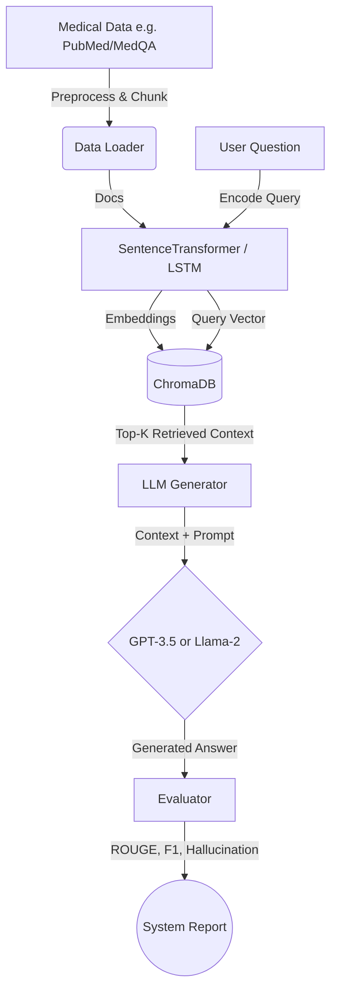

# 🏥 MedBot Pro: Advanced Medical RAG Platform

[](https://www.python.org/downloads/)
[](https://pytorch.org/)
[](https://opensource.org/licenses/MIT)

**MedBot** is a production-ready Machine Learning system that benchmarks Retrieval-Augmented Generation (RAG) performance on complex medical domain questions (e.g., USMLE). It establishes a scalable, modular architecture integrating dense vector retrieval (ChromaDB) with large language models to accurately synthesize biomedical literature into concrete diagnostic answers.

## 🎯 Key Features
- **Modular Pipeline:** Decoupled data ingestion, embedding, vector retrieval, generation, and evaluation components following clean architecture principles.
- **Advanced Retrieval:** Includes a custom-trained PyTorch LSTM Retriever baseline alongside generalized robust SentenceTransformer semantic search. 
- **ChromaDB Integration:** Fast, disk-persistent vector storage for medical corpora (PubMed, internal knowledge bases).
- **Multi-Generator Support:** Easily swappable LLM backends (GPT-3.5-Turbo via OpenAI API or Local/HF Llama-2-7b-chat).
- **Comprehensive Benchmarking:** Automated pipeline calculating ROUGE (1/2/L), Retrieval F1, Hallucination Rates, and Response Latency across models.

---

## 🏗️ Architecture



---

## ⚡ Quick Start

### 1. Installation

Clone the repository and install the exact verified dependencies:

```bash
git clone https://github.com/Flamechargerr/MedBot-trial.git
cd MedBot-trial
pip install -r requirements.txt
```

### 2. Configuration

Copy the environment template and insert your API keys:

```bash
cp .env.example .env
```

Open `.env` and configure:
```env
OPENCALL_LLM_KEY=sk-xxxx
HUGGINGFACE_API_KEY=hf_xxxx (Optional: only needed for Llama-2)
```

### 3. Run the Project
You can interact with MedBot either through the command line benchmarking tool or through a clean visual web interface.

**Visual Web Application (MedBot Pro Dashboard)**
```bash
python3 app.py
```
*This launches a premium Gradio-powered dashboard at `http://localhost:7860`. Features include real-time latency metrics, interactive source documentation, and knowledge-base management.*

**Command Line Benchmark Evaluation**
Execute the main pipeline evaluation on the configured dataset:

```bash
# Run full evaluation
python3 main.py

# Run a fast smoke test / demo (2 questions, small synthetic corpus)
python3 main.py --demo
```

---

## 📂 Repository Structure

```
MedBot/
├── main.py                  # CLI Entrypoint for pipeline execution
├── requirements.txt         # Pinned python dependencies
├── .env.example             # Environment variable template
├── chroma_db/               # Persistent directory for Vector Store
└── src/
    ├── config.py            # Centralized system configurations
    ├── data_loader.py       # MedQA and Medical corpus ingestion
    ├── retrieval/
    │   ├── lstm_retriever.py# PyTorch LSTM Retriever definition and training
    │   └── vector_store.py  # ChromaDB semantic search integration
    ├── generation/
    │   └── llm_generators.py# Wrapper classes for ChatGPT and Llama-2
    └── evaluation/
        └── metrics.py       # Computation of ROUGE, F1, & Hallucination
```

---

## 📊 Evaluation Metrics
The system grades performance based on:
1. **ROUGE (1/2/L):** Longest Common Subsequence and n-gram overlap capturing semantic generation fidelity against physician-provided ground truth.
2. **Retrieval F1:** The precision/recall of the isolated vector database hitting relevant document chunks.
3. **Hallucination Rate:** Token-overlap metric heavily penalizing generated text that attempts to fabricate knowledge outside of the retrieved context bounds.
4. **Latency:** Total pipeline time-to-first-token tracking. 

## ⚖️ License
Distributed under the MIT License. See `LICENSE` for more information.
